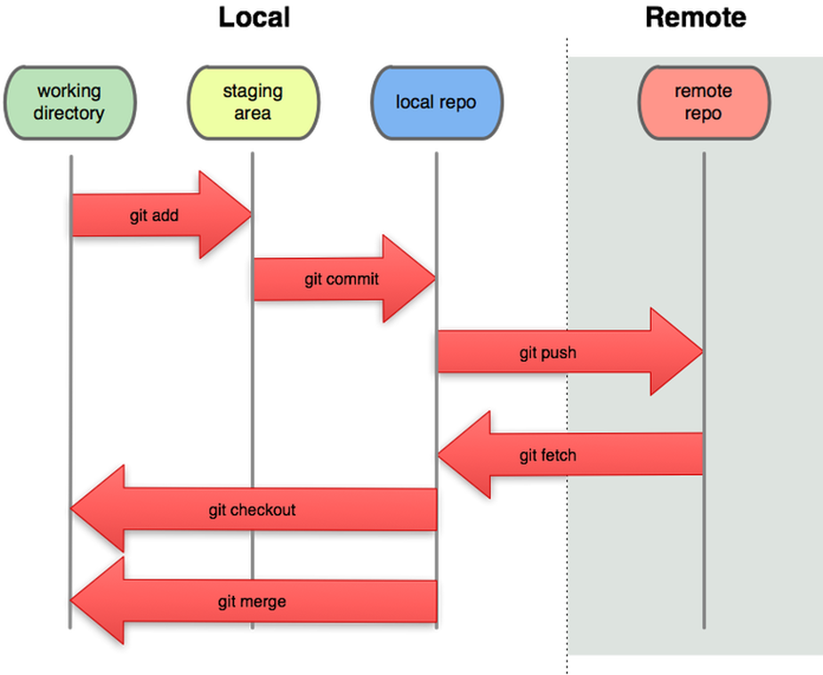

# Git & GitHub

```text
“Perfection is achieved, not when there is nothing more to add, but when there is nothing left to take away.”
- Antoine de Saint-Exupéry
```


## Content

- [Git \& GitHub](#git--github)
  - [Content](#content)
    - [1. Git](#1-git)
    - [2. Bash (GitBash)](#2-bash-gitbash)
    - [3. vi (CLI visual editor)](#3-vi-cli-visual-editor)
    - [4. GitHub](#4-github)

### 1. [Git](https://git-scm.com)

- Install from [downloads page](https://git-scm.com/downloads) - choose **GitBash**

- [Git documentation](https://git-scm.com/doc)
  - [Pro Git - 2nd Edition (2014)](https://git-scm.com/book/en/v2)



### 2. Bash (GitBash)

- `.` represents current folder
- `..` represents parent folder
- `/` is the path separator (linux style)

```bash
# IMPORTANT: use TAB key for path autocompletion

pwd # print working directory

ls -all # list all files in work directory
mkdir git_bash_demo # creates git_bash_demo directory

cd git_bash_demo # change work directory to git_bash_demo
cd - # toggle to previous work directory

touch file.txt # create new file
echo "first line" > file.txt # creates file.txt and writes "first line" in it
echo "second line" >> file.txt # appends "second line" to file.txt
cat file.txt # prints file.txt content
rm file.txt # deletes file.txt; to remove a folder add a -r flag; use -f to force deleting a file/folder
```

### 3. vi (CLI visual editor)

### 4. [GitHub](https://github.com)
